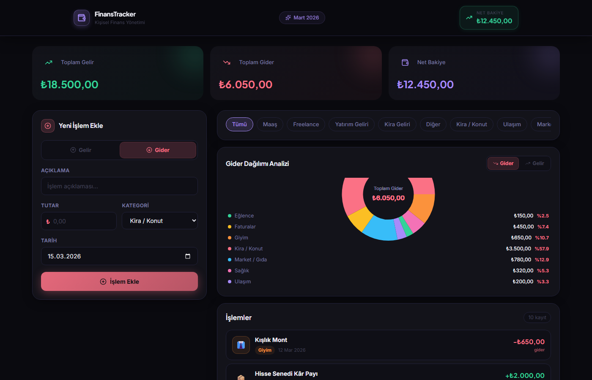
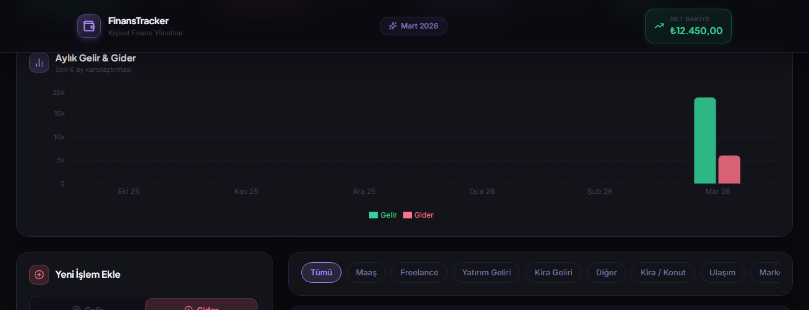
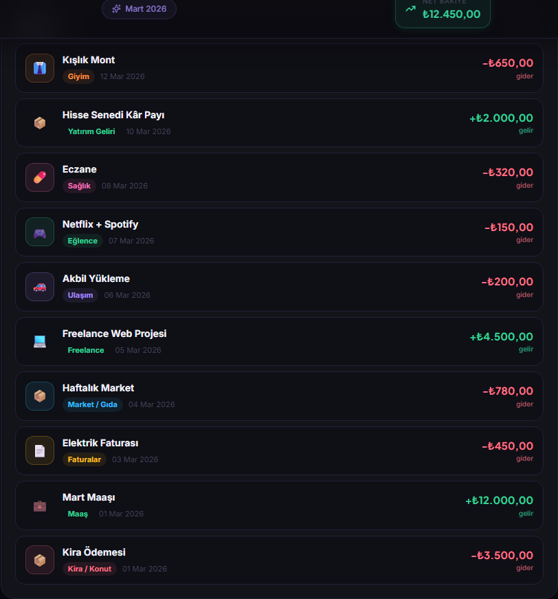
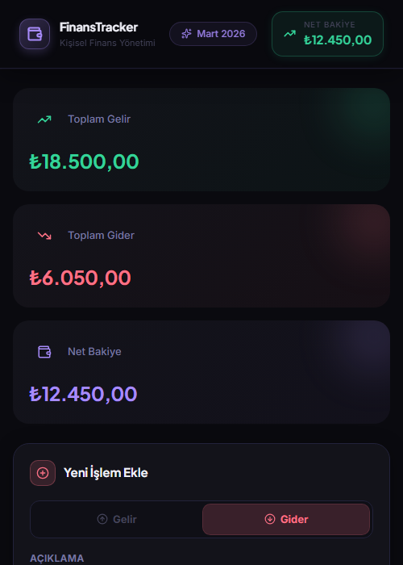
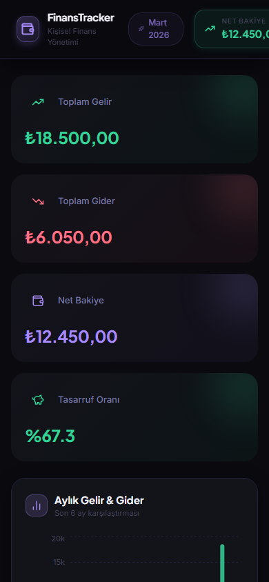

<h1 align="center">
  
  <br/><br/>
  FinansTracker
</h1>

<p align="center">
  A modern personal finance management app built with React, TypeScript &amp; Vite.
  <br/>
  Track your income, expenses, and savings — all in one clean dark-themed dashboard.
</p>

<p align="center">
  
  
  
  
  
  
</p>

---

## Features

- **Income & Expense Tracking** — Add transactions with description, amount, category, and date
- **Real-time Summary Cards** — Total income, total expense, net balance, and savings rate at a glance
- **Monthly Bar Chart** — Last 6 months income vs. expense comparison
- **Pie Chart Analytics** — Category-level breakdown of spending and income
- **Category Filter** — Filter all views by a specific category instantly
- **Edit & Delete** — Full CRUD — modify or remove any transaction via an animated modal
- **Data Persistence** — All data is saved to `localStorage`, survives page refreshes
- **Smooth Animations** — Powered by Framer Motion throughout the entire UI
- **Responsive Design** — Works on desktop, tablet, and mobile

---

## Screenshots

### Full Dashboard


### Monthly Income & Expense Chart


### Transaction List — Edit & Delete


### Add New Transaction


### Mobile View


---

## Tech Stack

| Layer | Technology |
|-------|-----------|
| Framework | React 19 + TypeScript |
| Build Tool | Vite 8 |
| Styling | Tailwind CSS 4 + CSS Variables |
| Charts | Recharts |
| Animations | Framer Motion |
| Icons | Lucide React |
| Persistence | localStorage API |

---

## Getting Started

### Prerequisites

- Node.js 18+
- npm

### Installation

```bash
# Clone the repository
git clone https://github.com/furkanerrn/finance-tracker.git
cd finance-tracker

# Install dependencies
npm install

# Start the development server
npm run dev
```

Open [http://localhost:5173](http://localhost:5173) in your browser.

### Build for Production

```bash
npm run build
```

---

## Project Structure

```
src/
├── components/
│   ├── Header.tsx           # Sticky header with live balance chip
│   ├── SummaryCards.tsx     # 4 animated metric cards
│   ├── MonthlyChart.tsx     # 6-month income vs. expense bar chart
│   ├── TransactionForm.tsx  # Add new transaction form
│   ├── CategoryFilter.tsx   # Horizontal category filter pills
│   ├── PieChartPanel.tsx    # Donut chart with legend
│   ├── TransactionList.tsx  # Scrollable list with edit/delete actions
│   └── EditModal.tsx        # Animated edit modal
├── data/
│   └── dummy.ts             # Seed data & category color maps
├── types/
│   └── index.ts             # TypeScript interfaces
└── utils/
    └── format.ts            # Currency & date formatters (tr-TR)
```

---

## License

MIT © [furkanerrn](https://github.com/furkanerrn)
